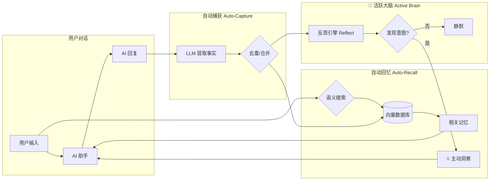

# OpenClaw 长期记忆插件 (mem0)

让你的 AI 助手拥有**真正的记忆力** — 语义搜索、自动提取、主动提醒。

<p align="center">
  
</p>

---

## ⚡ 3 分钟快速安装

### 第一步：下载插件

```bash
curl -L https://github.com/1960697431/openclaw-mem0/archive/refs/heads/main.zip -o mem0.zip \
  && unzip -o mem0.zip \
  && mkdir -p ~/.openclaw/extensions/openclaw-mem0 \
  && cp -r openclaw-mem0-main/* ~/.openclaw/extensions/openclaw-mem0/ \
  && rm -rf openclaw-mem0-main mem0.zip \
  && cd ~/.openclaw/extensions/openclaw-mem0 \
  && npm install --production
```

### 第二步：配置 `~/.openclaw/openclaw.json`

在 `plugins` 部分添加：

```json
{
  "plugins": {
    "enabled": true,
    "slots": {
      "memory": "openclaw-mem0"
    },
    "entries": {
      "openclaw-mem0": {
        "enabled": true,
        "config": {
          "mode": "open-source",
          "userId": "default",
          "autoRecall": true,
          "autoCapture": true,
          "topK": 5,
          "oss": {
            "embedder": {
              "provider": "transformersjs",
              "config": { "model": "onnx-community/Qwen3-Embedding-0.6B-ONNX" }
            },
            "llm": {
              "provider": "openai",
              "config": {
                "apiKey": "你的API密钥",
                "model": "deepseek-chat",
                "baseURL": "https://api.deepseek.com/v1"
              }
            }
          }
        }
      }
    }
  }
}
```

> 💡 `llm` 的配置决定了记忆提取的质量。推荐 DeepSeek（便宜好用）或 Ollama（纯本地）。详见下方 [LLM 配置大全](#-llm-配置大全)。

### 第三步：重启 Gateway

```bash
openclaw gateway restart
```

首次启动会自动从 GitHub Releases 下载嵌入模型（约 417MB 压缩包），之后即可离线使用。

**✅ 安装完成！** 现在正常和 AI 对话即可，记忆会全自动运行。

---

## 📊 工作原理

```
用户发消息: "帮我用 Next.js 写一个博客"
  │
  │  ┌──── Auto-Recall (对话前) ────────────┐
  │  │                                       │
  │  │  语义搜索向量数据库 → 返回 Top-5:     │
  │  │  · "用户熟悉 React 和 TypeScript"     │
  │  │  · "用户偏好 Tailwind CSS"            │
  │  │  → 注入到 Agent 系统上下文            │
  │  └───────────────────────────────────────┘
  │
  ▼
Agent 基于记忆给出个性化回复
  │
  │  ┌──── Auto-Capture (对话后) ───────────┐
  │  │                                       │
  │  │  LLM 提取新知识:                      │
  │  │  → "用户想用 Next.js 写博客"          │
  │  │  → 自动去重 / 合并 / 存入向量数据库   │
  │  │                                       │
  │  │  反思引擎分析:                        │
  │  │  → 发现隐含意图？→ 生成主动提醒       │
  │  └───────────────────────────────────────┘
```



**核心概念：**
- **嵌入模型 (Embedder)** = 图书管理员 — 负责搜索和召回，完全本地运行，零外部依赖
- **LLM** = 智能秘书 — 负责从对话中提取重要事实，需要配置 API

> 如果你发现"模型加载成功"但"No memories found"，通常是 **LLM 配置有误**（Key 或 URL 错误），导致无法提取事实。

---

## 🤔 为什么用这个而不用官方记忆？

| 特性 | OpenClaw 官方记忆 | 本插件 (mem0) |
|------|-------------------|--------------|
| **存储方式** | 文件 (memory.md) | 向量数据库 |
| **召回方式** | 全量加载到上下文 | 语义搜索 Top-K |
| **Token 消耗** | 随记忆增长膨胀 (2000+) | **固定 ~300 tokens** |
| **存储效率** | 越写越厚 | 自动去重、合并 |
| **100 条记忆时** | 全部加载 (10000+ tokens) | 依然只 Top-5 (~300 tokens) |
| **相关性** | 全部记忆都加载 | 只召回语义相关的 |
| **多用户** | 单用户 | 支持隔离 |
| **主动提醒** | ❌ | ✅ Active Brain |

**简单来说：** 官方记忆像一本**笔记本**，越写越厚，每次都要翻完；mem0 像一个**智能秘书**，只告诉你当前需要知道的，而且记忆量增长**不会消耗更多 Token**。

---

## 🧠 Active Brain（主动大脑）

在 Auto-Capture 之后，**反思引擎**会静默分析对话，发现用户的隐含意图：

- 🔔 "明天要开会" → 自动生成提醒
- 📋 "帮我跟进这个问题" → 生成跟进任务
- 💡 "我应该…" → 捕获行动意图

**三级投递策略**（确保你不会错过）：

| 级别 | 方式 | 说明 |
|------|------|------|
| 🚀 第一级 | **直接发送** | 通过 Gateway API 推送到 Telegram / 飞书 / iMessage 等 |
| ⏳ 第二级 | **下次注入** | 如果发送失败，在下次对话时自然提及 |
| 📝 第三级 | **静默日志** | 极端情况下记录到控制台 |

> 💡 渠道自动检测：只要你和 AI 聊过一次，插件就能记住在哪里找到你。无需手动配置。

---

## 🔧 LLM 配置大全

mem0 需要一个 LLM 来提取对话中的事实。以下是所有支持的配置方式：

> ⚠️ **重要**：Ollama 用 `url`，其他所有 OpenAI 兼容接口用 `baseURL`。搞混会连接失败！

### 配置速查表

| 供应商 | provider | 模型示例 | 特别说明 |
|--------|----------|---------|---------| 
| **DeepSeek** ⭐ | `openai` | `deepseek-chat` | 国内推荐，便宜好用 |
| **Ollama** (本地) | `ollama` | `qwen3:32b` | 用 `url` 不是 `baseURL` |
| OpenAI | `openai` | `gpt-4o` | 无需 baseURL |
| 通义千问 | `openai` | `qwen-plus` | 阿里云 DashScope |
| Kimi | `openai` | `moonshot-v1-8k` | 月之暗面 |
| 智谱AI | `openai` | `glm-4-flash` | 免费可用 |
| 硅基流动 | `openai` | `deepseek-ai/DeepSeek-V3` | 聚合多家模型 |
| 零一万物 | `openai` | `yi-lightning` | 01.AI |

<details>
<summary><strong>📋 各供应商详细配置（点击展开）</strong></summary>

#### 🔥 DeepSeek（推荐国内用户）

```json
"llm": {
  "provider": "openai",
  "config": {
    "apiKey": "sk-xxxxxxxxxxxxxxxxxxxxxxxx",
    "model": "deepseek-chat",
    "baseURL": "https://api.deepseek.com/v1"
  }
}
```
申请地址：[platform.deepseek.com](https://platform.deepseek.com)

#### 🖥️ Ollama（本地 LLM）

> ⚠️ 注意是 **`url`**，不是 `baseURL`！

```json
"llm": {
  "provider": "ollama",
  "config": {
    "model": "qwen3:32b",
    "url": "http://127.0.0.1:11434"
  }
}
```

推荐模型：`qwen3:32b`（最佳）→ `qwen2.5:14b`（平衡）→ `qwen2.5:7b`（轻量）

#### 🇺🇸 OpenAI

```json
"llm": {
  "provider": "openai",
  "config": {
    "apiKey": "sk-xxxxxxxxxxxxxxxxxxxxxxxx",
    "model": "gpt-4o"
  }
}
```

#### ☁️ 通义千问 / DashScope

```json
"llm": {
  "provider": "openai",
  "config": {
    "apiKey": "sk-xxxxxxxxxxxxxxxxxxxxxxxx",
    "model": "qwen-plus",
    "baseURL": "https://dashscope.aliyuncs.com/compatible-mode/v1"
  }
}
```

#### 🌙 Kimi / Moonshot

```json
"llm": {
  "provider": "openai",
  "config": {
    "apiKey": "sk-xxxxxxxxxxxxxxxxxxxxxxxx",
    "model": "moonshot-v1-8k",
    "baseURL": "https://api.moonshot.cn/v1"
  }
}
```

#### 🧠 智谱AI / GLM

```json
"llm": {
  "provider": "openai",
  "config": {
    "apiKey": "xxxxxxxxxxxxxxxxxxxxxxxx.xxxxxxxxxxxxxx",
    "model": "glm-4-flash",
    "baseURL": "https://open.bigmodel.cn/api/paas/v4"
  }
}
```

#### ⚡ 硅基流动 / SiliconFlow

```json
"llm": {
  "provider": "openai",
  "config": {
    "apiKey": "sk-xxxxxxxxxxxxxxxxxxxxxxxx",
    "model": "deepseek-ai/DeepSeek-V3",
    "baseURL": "https://api.siliconflow.cn/v1"
  }
}
```

#### 🌟 零一万物 / 01.AI

```json
"llm": {
  "provider": "openai",
  "config": {
    "apiKey": "sk-xxxxxxxxxxxxxxxxxxxxxxxx",
    "model": "yi-lightning",
    "baseURL": "https://api.lingyiwanwu.com/v1"
  }
}
```

#### 🔌 Antigravity Manager（本地代理）

```json
"llm": {
  "provider": "openai",
  "config": {
    "apiKey": "你的密钥",
    "model": "gemini-3-flash",
    "baseURL": "http://localhost:8045/v1"
  }
}
```

</details>

---

## 🛠️ 全部配置项

| 配置项 | 类型 | 默认值 | 说明 |
|--------|------|--------|------|
| `mode` | string | `"open-source"` | `"open-source"` 或 `"platform"` |
| `userId` | string | `"default"` | 用户 ID，用于记忆隔离 |
| `autoRecall` | bool | `true` | 对话前自动搜索相关记忆 |
| `autoCapture` | bool | `true` | 对话后自动提取并存储新知识 |
| `topK` | number | `5` | 每次召回的最大记忆条数 |
| `searchThreshold` | number | `0.5` | 语义匹配阈值 (0-1) |
| `gatewayPort` | number | `3000` | Gateway 端口（非默认端口时需设置） |
| `proactiveChannel` | string | 自动检测 | 主动消息渠道 (`telegram`/`feishu`/`imessage`) |
| `proactiveTarget` | string | 自动检测 | 目标 ID (chat_id / 手机号) |

### 嵌入模型选择

| 模型 | 维度 | 大小 | 语言 |
|------|------|------|------|
| `onnx-community/Qwen3-Embedding-0.6B-ONNX` ⭐ | 1024 | ~585MB（首次自动从 GitHub Releases 下载） | 100+ |
| `Xenova/bge-small-en-v1.5` | 384 | ~130MB | 英文 |
| `Xenova/multilingual-e5-large` | 1024 | ~2GB | 多语言 |

---

## 🛠️ AI 工具 & CLI

### AI 工具（自动注册）

| 工具 | 说明 |
|------|------|
| `memory_search` | 语义搜索记忆 |
| `memory_store` | 手动存储记忆 |
| `memory_list` | 列出所有记忆 |
| `memory_get` | 获取指定记忆 |
| `memory_forget` | 删除记忆 |

### CLI 命令

```bash
openclaw mem0 search "用户的编程偏好"    # 搜索记忆
openclaw mem0 stats                      # 查看统计
openclaw mem0 list                       # 列出所有
```

---

## ❓ 常见问题

| 问题 | 解决方案 |
|------|---------|
| **401 No cookie auth...** | 升级到 v0.3.1+（已修复 OpenRouter Headers） |
| **Cannot find module...** | 运行 `npm install --production` |
| **No memories found** | LLM 配置错误（检查 apiKey / baseURL） |
| **Ollama 连不上** | 用 `url` 不是 `baseURL` |
| **Proactive Message 失败** | 设置 `"gatewayPort": 你的端口` |
| **ETIMEDOUT** | 国内网络访问 OpenAI 超时，换国产 API |
| **首次启动很慢** | 正常 — 正在从 GitHub Releases 下载约 417MB 嵌入模型 |
| **模型下载失败 (fetch failed)** | 模型默认从 GitHub 下载（国内可达）。如仍失败，可设置 `export HF_ENDPOINT=https://hf-mirror.com` 回退到 HuggingFace 镜像 |
| **需要翻墙吗？** | 嵌入模型从 GitHub Releases 下载，不需要翻墙；LLM 取决于你的配置 |
| **与官方记忆冲突吗？** | 不会，两者独立运行 |
| **支持多用户吗？** | 支持，设置不同的 `userId` 即可 |
| **记忆存在哪？** | `~/.openclaw/mem0-vectors.db` |

---

## 🔄 自动更新

本插件内置**自我更新引擎**，每次 Gateway 启动时自动检查 GitHub 最新版本。

- 不依赖 `npm` 或 `openclaw plugins update`
- 只要 GitHub 版本号 > 本地版本号 → 自动下载覆盖
- **当前版本：`v0.3.4`**

> ⚠️ 旧版本（v0.2.x 及以下）没有自动更新功能，必须手动运行一次上方的安装命令来获取自动更新能力。

### v0.3.4 更新内容

- **修复国内模型下载失败**：嵌入模型改为从 GitHub Releases 下载（国内可达），不再依赖 HuggingFace
- 首次运行自动下载 → 本地缓存 → 后续零网络依赖
- 下载失败自动回退到 HuggingFace（支持 `HF_ENDPOINT` 镜像）
- 下载过程带 3 次重试和进度日志

---

## 📄 License

Apache 2.0

---

<details>
<summary><strong>🇬🇧 English Documentation</strong></summary>

## What is this?

Long-term memory plugin for [OpenClaw](https://github.com/openclaw/openclaw) agents, powered by [Mem0](https://mem0.ai).

Your agent forgets everything between sessions. This plugin fixes that. It watches conversations, extracts what matters, and brings it back when relevant — automatically.

### Features

- **Auto-Recall** — Injects relevant memories before each response
- **Auto-Capture** — Extracts and stores facts after each exchange
- **Active Brain** — Proactive reminders and intent detection
- **Local Embeddings** — Run ONNX models locally via transformers.js (zero dependencies)
- **Multi-language** — Qwen3 supports 100+ languages
- **Token Efficient** — Only Top-K semantic matches, constant cost regardless of memory size

### Quick Start

```bash
curl -L https://github.com/1960697431/openclaw-mem0/archive/refs/heads/main.zip -o mem0.zip \
  && unzip -o mem0.zip \
  && mkdir -p ~/.openclaw/extensions/openclaw-mem0 \
  && cp -r openclaw-mem0-main/* ~/.openclaw/extensions/openclaw-mem0/ \
  && rm -rf openclaw-mem0-main mem0.zip \
  && cd ~/.openclaw/extensions/openclaw-mem0 \
  && npm install --production
```

See the Chinese documentation above for detailed configuration.

</details>
