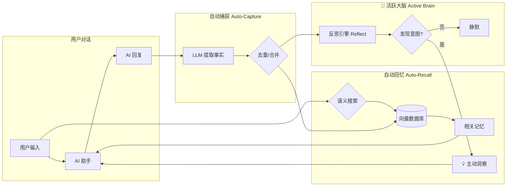

# OpenClaw 长期记忆插件 (mem0)

让你的 AI 助手拥有**真正的记忆力**。

<p align="center">
  
</p>

---

## 🤔 为什么需要这个插件？

### 与 OpenClaw 官方记忆对比

| 特性 | OpenClaw 官方记忆 | mem0 插件 |
|------|-------------------|-----------|
| **记忆方式** | 文件存储 (memory.md) | 向量数据库 + 语义搜索 |
| **召回方式** | 全量加载到上下文 | 智能搜索最相关的 Top-K |
| **存储效率** | 随对话增长，上下文膨胀 | 记忆去重、合并、更新 |
| **相关性** | 全部记忆都加载 | 只召回语义相关的记忆 |
| **多用户** | 单用户 | 支持多用户隔离 |
| **跨会话** | ✅ | ✅ |

**简单来说：**
- 官方记忆像一本**笔记本**，越写越厚，每次都要翻完
- mem0 像一个**智能秘书**，只告诉你当前需要知道的

### 与原版 mem0 插件对比

这个项目是基于 [mem0ai/mem0](https://github.com/mem0ai/mem0) 官方 SDK 的增强版本：

| 特性 | 原版 mem0 | 本插件 (增强版) |
|------|-----------|----------------|
| **嵌入模型** | Ollama + nomic-embed-text (768 dims) | transformersjs + Qwen3 (1024 dims) |
| **外部依赖** | 需要 Ollama 服务 | 零依赖，纯 Node.js |
| **LLM 兼容** | 需要返回纯 JSON | 自动清理 markdown 包装 |
| **存储路径** | 不固定 (随 cwd 变化) | 固定在 `~/.openclaw/` |
| **多语言** | 英文为主 | 100+ 语言（Qwen3） |
| **Proactive Agent** | ✅ autoRecall + autoCapture | ✅ 完全保留 |

**增强内容：**
- 🚀 **TransformersJsEmbedder** — 本地 ONNX 嵌入，无需 Ollama
- 🔧 **JsonCleaningLLM** — 自动剥离 Gemini 等模型返回的 markdown
- 📁 **固定存储路径** — 避免数据分散在不同目录

---

## 💡 插件设计与运行逻辑

### 1. 是“开箱即用”吗？
**核心部分（嵌入模型）是开箱即用的**。
*   **零外部依赖**：无需安装 Ollama 或 Python。
*   **全自动模型下载**：首次运行（搜索或对话）时，插件会自动下载并缓存约 700MB 的 Qwen3 嵌入模型，随后即可离线使用。

### 2. 用户还需要配置什么？
用户唯一需要关注的是 **LLM 的配置**。因为 mem0 需要 LLM 来从对话中提取新知识：
*   **推荐方案**：使用 **Antigravity Manager** 项目，或者 OpenAI 以及支持 OpenAI 格式的 API 平台。
*   **本地方案**：如果你追求纯本地，也可以指向自建的 **Ollama** (如 `llama3`)。

### 3. 本地模型 vs LLM：它们是什么关系？
这是很多用户的困惑点。简单来说：它们是并存的，分工不同。

*   **本地嵌入模型 (Embedder - “图书管理员”)**：负责**搜索和召回**。它把文字翻译成数字向量，在数据库里查找相关内容。我们实现了它的完全本地化（零依赖）。
*   **LLM (智能引擎 - “秘书”)**：负责**理解、提取和反思**。它需要阅读长篇对话并判断哪些是值得记录的事实。这个过程需要较强的推理能力，因此需要配置一个 LLM（云端的或本地 Ollama）。

> **总结：** 如果你发现“模型加载成功”但“No memories found”，通常是因为你的 **LLM 配置有误**（Key 或 URL 错误）。导致“秘书”无法从对话中提取事实，即便“管理员”再勤快，书架上也是空的。

### 4. 会和 OpenClaw 自带的记忆冲突吗？
**不会，它们是相辅相成的并联关系：**
*   **共同存在**：官方 `.md` 记忆和 mem0 数据库独立运行，不会互相覆盖。
*   **高优先级召回**：mem0 会在 Agent 响应前，将最相关的背景直接注入到“系统上下文”中。Agent 一睁眼就能看到这些精准信息，而不需要去翻阅长长的文件。

---

## 📊 工作原理



### 流程说明

1. **自动回忆 (Auto-Recall)**
   - 用户发送消息时，插件自动搜索向量数据库
   - 找到语义最相关的 Top-K 条记忆
   - 注入到 AI 的上下文中

2. **自动捕获 (Auto-Capture)**
   - AI 回复后，插件调用 LLM 提取对话中的重要事实
   - 新事实自动去重、与旧记忆合并
   - 存入向量数据库

3. **🧠 活跃大脑 (Active Brain)** — *灵感源自 [memU](https://github.com/NevaMind-AI/memU)*
   - 每次存入新记忆后，**反思引擎**自动分析对话，发现用户隐含意图
   - 检测到任务/提醒/跟进时，生成待触发行动
   - 心跳定时器每 60 秒检查一次，到期行动在下次对话时自动注入上下文
   - 全程静默运行，无需任何配置

---

## 🧠 Active Brain 详解

Active Brain 是本插件的核心功能，旨在让 AI 助手从“被动响应”转变为“主动关注”。

### 1. 运行原理
Active Brain 建立在 **反思引擎 (Reflection Engine)** 之上：
*   **观察**：每次会话结束（Auto-Capture 完成后），反思引擎会自动异步分析最新的对话内容。
*   **反思**：它会判断用户是否表达了隐含的意图（如：“明天帮我跟进一下 X”、“周三下午三点提醒我开会”）。
*   **计划**：如果发现意图，它会生成一个 `PendingAction` 存入队列，并计算触发时间。
*   **触发**：后台心跳（每 60 秒）检查队列，一旦到期，立即尝试通过最优方案投递消息。

### 2. 三级降级投递策略
为了确保你绝对不会错过 AI 的主动反馈，我们设计了三级降级逻辑：

1.  **🚀 第一级：直接投递 (Gateway Send)**
    *   **时机**：心跳检测到行动到期时。
    *   **效果**：AI 会像真人一样，“主动”给你发一条消息。
    *   **渠道**：优先使用 `proactiveChannel` 配置，或自动检测最后一次对话的渠道（如 Telegram、飞书、iMessage）。
2.  **⏳ 第二级：下次对话注入 (Next-turn Injection)**
    *   **时机**：如果第一级由于 Gateway 掉线、渠道 ID 未知等原因失败。
    *   **效果**：当下次你主动找 AI 聊天时，插件会将该项“主动洞察”注入到 AI 的思维上下文。
    *   **表现**：AI 在回答你当前问题的同时，会顺便说：“对了，关于你上次提到的...”。
3.  **📝 第三级：静默日志 (Silent Logs)**
    *   **时机**：极端情况下（如目标 ID 完全无法确定）。
    *   *效果**：记录在控制台日志中。

### 3. 渠道自动检测 (Zero-Config)
你无需手动查找那长串的 Telegram `chat_id` 或 iMessage 手机号。
插件会自动捕捉你最后一次活跃的：
*   `channelId` (如 `imessage`)
*   `from` (如 `+86138...`)
*   `accountId` (如 `bluebubbles`)
只要你和它聊过一次，它就能记住下次该在哪里找到你。

---

## ✨ 核心优势

| 优势 | 说明 |
|------|------|
| 🧠 **智能记忆** | 自动提取对话中的重要信息，无需手动记录 |
| 🔍 **语义搜索** | 基于意思而非关键词匹配，找到真正相关的记忆 |
| 🏠 **完全本地** | 支持本地嵌入模型，数据不出本机 |
| 📦 **零依赖** | 使用 transformersjs，无需 Ollama、Python |
| 🌍 **多语言** | Qwen3 模型支持 100+ 语言（包括中文） |
| 🔄 **自动去重** | 相似记忆自动合并，避免重复 |

---

## 🚀 快速开始

### 1. 安装插件

```bash
openclaw plugins install https://github.com/1960697431/openclaw-mem0
```

### 2. 配置 (openclaw.json)

在 `plugins.entries` 中添加：

```json
"openclaw-mem0": {
  "enabled": true,
  "config": {
    "mode": "open-source",
    "userId": "你的用户名",
    "autoRecall": true,
    "autoCapture": true,
    "proactiveChannel": "telegram",
    "proactiveTarget": "你的chat_id",
    "oss": {
      "embedder": {
        "provider": "transformersjs",
        "config": { "model": "onnx-community/Qwen3-Embedding-0.6B-ONNX" }
      },
      "vectorStore": {
        "provider": "memory",
        "config": {
          "dimension": 1024,
          "dbPath": "~/.openclaw/mem0-vectors.db"
        }
      },
      "llm": {
        "provider": "openai",
        "config": {
          "apiKey": "你的API密钥",
          "model": "gpt-4o",
          "baseURL": "https://api.openai.com/v1"
        }
      },
      "historyDbPath": "~/.openclaw/mem0-history.db"
    }
  }
}
```

### 3. 重启 OpenClaw

```bash
launchctl kickstart -k gui/$(id -u)/ai.openclaw.gateway
```

首次启动会自动下载嵌入模型（约 700MB）。

---

### 4. 配置主动消息（可选）

插件默认会**自动检测**你最后活跃的渠道和发送者。如果你想固定推送到某个渠道：

```json
{
  "proactiveChannel": "telegram",
  "proactiveTarget": "你的chat_id或手机号"
}
```

| 配置项 | 说明 | 示例 |
|--------|------|------|
| `proactiveChannel` | 发送渠道 | `"telegram"`, `"imessage"`, `"feishu"`, `"discord"` |
| `proactiveTarget` | 目标 ID | Telegram chat_id, iMessage 手机号, 飞书 user_id |

> **不填也没关系！** 如果不配置，插件会自动检测你最后一次对话的渠道和身份。如果完全无法确定目标，洞察会在下次对话时自然注入上下文。

---

## 🔧 配置详解

### 本地嵌入模型 (推荐)

使用 `transformersjs` 运行本地 ONNX 模型，**无需 Ollama、无需 Python、无需 API**：

| 模型 | 维度 | 大小 | 语言 |
|------|------|------|------|
| `onnx-community/Qwen3-Embedding-0.6B-ONNX` ⭐ | 1024 | ~700MB | 100+ |
| `Xenova/bge-small-en-v1.5` | 384 | ~130MB | 英文 |
| `Xenova/multilingual-e5-large` | 1024 | ~2GB | 多语言 |

### LLM 配置大全

mem0 需要一个 LLM 来从对话中**提取事实**。支持的 `provider` 有：`openai`、`ollama`、`anthropic`、`groq`、`google`/`gemini`、`azure_openai`、`mistral`。

> ⚠️ **重要**：`openai` 和 `ollama` 的配置字段**不同**！Ollama 用 `url`，OpenAI 兼容接口用 `baseURL`。搞混会导致连接失败。

#### 配置速查表

| 供应商 | provider | 模型示例 | 特别说明 |
|--------|----------|---------|---------|
| Ollama (本地) | `ollama` | `qwen3:32b` | 用 `url` 不是 `baseURL` |
| OpenAI | `openai` | `gpt-4o` | 默认 baseURL |
| DeepSeek | `openai` | `deepseek-chat` | OpenAI 兼容 |
| 通义千问 (DashScope) | `openai` | `qwen-plus` | OpenAI 兼容 |
| Kimi (月之暗面) | `openai` | `moonshot-v1-8k` | OpenAI 兼容 |
| 智谱AI (GLM) | `openai` | `glm-4-flash` | OpenAI 兼容 |
| 硅基流动 (SiliconFlow) | `openai` | `deepseek-ai/DeepSeek-V3` | OpenAI 兼容 |
| 零一万物 (01.AI) | `openai` | `yi-lightning` | OpenAI 兼容 |
| Anthropic | `anthropic` | `claude-sonnet-4-20250514` | 需要 anthropic SDK |
| Google Gemini | `gemini` | `gemini-2.5-flash` | 需要 Google SDK |
| Groq | `groq` | `llama-3.3-70b-versatile` | Groq 加速推理 |

---

#### 🖥️ Ollama（本地 LLM）

> ⚠️ Ollama 的配置字段是 **`url`**，不是 `baseURL`！这是最常见的配置错误。

```json
"llm": {
  "provider": "ollama",
  "config": {
    "model": "qwen3:32b",
    "url": "http://127.0.0.1:11434"
  }
}
```

**运行 `ollama list` 确认你的模型名称拼写正确。**

推荐模型（按能力排序）：

| 模型 | 推荐场景 | 说明 |
|------|---------|------|
| `qwen3:32b` | 最佳效果 | 中英文均强，需要 ~20GB 显存 |
| `qwen2.5:14b` | 平衡之选 | 效果好，需要 ~10GB 显存 |
| `qwen2.5:7b` | 轻量方案 | 够用，需要 ~5GB 显存 |
| `llama3.1:8b` | 英文为主 | Meta 开源模型 |

---

#### 🔥 DeepSeek（推荐国内用户）

DeepSeek 的 API 完全兼容 OpenAI 格式，价格极低。

```json
"llm": {
  "provider": "openai",
  "config": {
    "apiKey": "sk-xxxxxxxxxxxxxxxxxxxxxxxx",
    "model": "deepseek-chat",
    "baseURL": "https://api.deepseek.com/v1"
  }
}
```

申请地址：[platform.deepseek.com](https://platform.deepseek.com)

| 模型 | 说明 |
|------|------|
| `deepseek-chat` | V3 模型，性价比极高 |
| `deepseek-reasoner` | R1 推理模型（更慢但更准） |

---

#### ☁️ 通义千问 / DashScope（阿里云）

```json
"llm": {
  "provider": "openai",
  "config": {
    "apiKey": "sk-xxxxxxxxxxxxxxxxxxxxxxxx",
    "model": "qwen-plus",
    "baseURL": "https://dashscope.aliyuncs.com/compatible-mode/v1"
  }
}
```

申请地址：[dashscope.console.aliyun.com](https://dashscope.console.aliyun.com)

| 模型 | 说明 |
|------|------|
| `qwen-turbo` | 最快最便宜 |
| `qwen-plus` | 平衡之选 ⭐ |
| `qwen-max` | 最强能力 |

---

#### 🌙 Kimi / Moonshot（月之暗面）

```json
"llm": {
  "provider": "openai",
  "config": {
    "apiKey": "sk-xxxxxxxxxxxxxxxxxxxxxxxx",
    "model": "moonshot-v1-8k",
    "baseURL": "https://api.moonshot.cn/v1"
  }
}
```

申请地址：[platform.moonshot.cn](https://platform.moonshot.cn)

| 模型 | 上下文长度 |
|------|-----------|
| `moonshot-v1-8k` | 8K |
| `moonshot-v1-32k` | 32K |
| `moonshot-v1-128k` | 128K |

---

#### 🧠 智谱AI / GLM

```json
"llm": {
  "provider": "openai",
  "config": {
    "apiKey": "xxxxxxxxxxxxxxxxxxxxxxxx.xxxxxxxxxxxxxx",
    "model": "glm-4-flash",
    "baseURL": "https://open.bigmodel.cn/api/paas/v4"
  }
}
```

申请地址：[open.bigmodel.cn](https://open.bigmodel.cn)

| 模型 | 说明 |
|------|------|
| `glm-4-flash` | 免费，速度快 ⭐ |
| `glm-4-plus` | 更强能力 |

---

#### ⚡ 硅基流动 / SiliconFlow

硅基流动聚合了多家开源模型，可以用一个 API Key 访问 DeepSeek、Qwen、Llama 等：

```json
"llm": {
  "provider": "openai",
  "config": {
    "apiKey": "sk-xxxxxxxxxxxxxxxxxxxxxxxx",
    "model": "deepseek-ai/DeepSeek-V3",
    "baseURL": "https://api.siliconflow.cn/v1"
  }
}
```

申请地址：[cloud.siliconflow.cn](https://cloud.siliconflow.cn)

---

#### 🌟 零一万物 / 01.AI

```json
"llm": {
  "provider": "openai",
  "config": {
    "apiKey": "sk-xxxxxxxxxxxxxxxxxxxxxxxx",
    "model": "yi-lightning",
    "baseURL": "https://api.lingyiwanwu.com/v1"
  }
}
```

---

#### 🇺🇸 OpenAI

```json
"llm": {
  "provider": "openai",
  "config": {
    "apiKey": "sk-xxxxxxxxxxxxxxxxxxxxxxxx",
    "model": "gpt-4o"
  }
}
```

> 无需填 `baseURL`，SDK 默认连接 `api.openai.com`。

---

#### 🔌 Antigravity Manager（本地代理）

如果你使用 Antigravity Manager 或其他本地 API 代理：

```json
"llm": {
  "provider": "openai",
  "config": {
    "apiKey": "你的密钥",
    "model": "gemini-3-flash",
    "baseURL": "http://localhost:8045/v1"
  }
}
```

> 💡 本插件内置 `JsonCleaningLLM`，自动处理 Gemini 等模型返回 markdown 代码块的问题。

---

#### ⚠️ 常见配置错误

| 错误 | 原因 | 解决 |
|------|------|------|
| "No memories found" | LLM 连接失败，提取不到事实 | 检查 apiKey 和 baseURL |
| Ollama 连不上 | 用了 `baseURL` 而不是 `url` | 改成 `"url": "http://..."` |
| JSON 解析失败 | 模型返回格式不规范 | 换用更强的模型或使用 DeepSeek |
| ETIMEDOUT | 国内网络访问 OpenAI 超时 | 换用国产 API 或配置代理 |

---

## 🛠️ AI 工具

安装后，AI 助手可以使用以下工具：

| 工具 | 说明 |
|------|------|
| `memory_search` | 搜索记忆 |
| `memory_store` | 保存记忆 |
| `memory_list` | 列出所有记忆 |
| `memory_get` | 获取指定记忆 |
| `memory_forget` | 删除记忆 |

---

## 📋 CLI 命令

```bash
# 搜索记忆
openclaw mem0 search "用户的编程偏好"

# 查看统计
openclaw mem0 stats

# 列出所有记忆
openclaw mem0 list
```

---

## ❓ 常见问题

**Q: 记忆存储在哪里？**
A: 默认在 `~/.openclaw/mem0-vectors.db`，通过 `dbPath` 可自定义。

**Q: 需要翻墙吗？**
A: 使用本地嵌入模型 (`transformersjs`) 不需要。LLM 部分取决于你的配置。

**Q: 支持多用户吗？**
A: 支持。设置不同的 `userId` 即可隔离记忆。

**Q: 与官方记忆会冲突吗？**
A: 不会。两者独立运行，可以同时使用。

---

## 📄 License

Apache 2.0

---

<details>
<summary><strong>🇬🇧 English Documentation</strong></summary>

## What is this?

Long-term memory plugin for [OpenClaw](https://github.com/openclaw/openclaw) agents, powered by [Mem0](https://mem0.ai).

Your agent forgets everything between sessions. This plugin fixes that. It watches conversations, extracts what matters, and brings it back when relevant — automatically.

### Features

- **Auto-Recall** — Injects relevant memories before each response
- **Auto-Capture** — Extracts and stores facts after each exchange
- **Local Embeddings** — Run ONNX models locally via transformers.js
- **Multi-language** — Qwen3 supports 100+ languages

### Quick Start

```bash
openclaw plugins install https://github.com/1960697431/openclaw-mem0
```

See the Chinese documentation above for detailed configuration.

</details>
