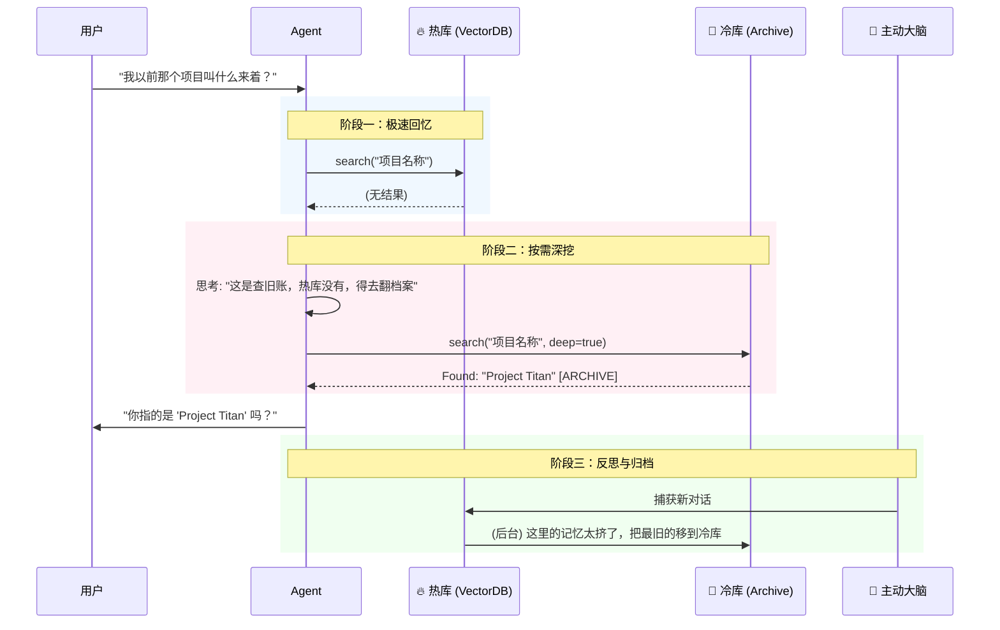

# 🧠 OpenClaw 长期记忆插件 (Mem0)

> **让你的 AI 助手拥有“大象般的记忆”与“猎豹般的速度”。**
> 基于 Mem0 构建的下一代智能记忆系统，支持语义搜索、自动归档与主动提醒。

<p align="center">
  
</p>

---

## 🌟 核心优势：为什么选择这个插件？

大多数记忆插件面临一个两难困境：**存得越多，系统越慢/内存占用越高。**
我们通过独创的 **“冷热分离架构 (Hot/Cold Dual-Tier Architecture)”** 完美解决了这个问题。

### 1. 🔥 热库 + 🧊 冷库：永不遗忘，极速响应 (v0.4.3+)
我们不把所有记忆都塞进昂贵的向量数据库（热库），而是智能分层：

| 特性 | 🔥 **热库 (Hot Storage)** | 🧊 **冷库 (Cold Archive)** |
| :--- | :--- | :--- |
| **存储介质** | 本地向量数据库 (Vector DB) | 纯文本归档 (JSONL Archive) |
| **内容** | 最近、最活跃的记忆 (默认 2000 条) | 所有的历史记忆 (无限容量) |
| **速度** | **毫秒级** (语义搜索) | 秒级 (流式扫描) |
| **内存占用** | 固定 (约 1.5GB) | **接近 0** (按需流式读取) |
| **自动维护** | 超过上限自动“退休”到冷库 | 永久保存，永不丢失 |

**✨ 你的收益**：无论你和 AI 聊了几年，存了多少亿条数据，OpenClaw 的**启动速度和内存占用永远像第一天一样轻快**。

### 2. 🕵️ 深度检索 (Agentic Deep Search)
如果热库里找不到？别担心。
我们实现了 **“按需深度检索”** —— AI 像人类一样思考：
1.  先翻“大脑”（热库）。
2.  如果没找到，且你问的是陈年旧事（如“我去年那个项目...”）。
3.  Agent 会**自主决定**开启 `deep: true` 模式，去翻阅“档案室”（冷库）。
4.  **零浪费**：对于无关的新问题，绝不浪费 IO 资源去扫冷库。

### 3. 🧠 主动大脑 (Active Brain)
不仅仅是存储，它还会思考。
- **持久化待办**：它会从对话中捕捉“明天提醒我...”的意图，并保存到磁盘。即使重启 Gateway，它依然记得提醒你。
- **三级推送**：支持 Telegram/飞书/微信 等渠道的主动推送。

---

## ⚡ 3 分钟快速安装

### 1. 下载插件
```bash
curl -L https://github.com/1960697431/openclaw-mem0/archive/refs/heads/main.zip -o mem0.zip \
  && unzip -o mem0.zip \
  && mkdir -p ~/.openclaw/extensions/openclaw-mem0 \
  && cp -r openclaw-mem0-main/* ~/.openclaw/extensions/openclaw-mem0/ \
  && rm -rf openclaw-mem0-main mem0.zip \
  && cd ~/.openclaw/extensions/openclaw-mem0 \
  && npm install --production
```

### 2. 配置 `~/.openclaw/openclaw.json`
只需在 `plugins` 中添加如下配置。

> 💡 **智能配置 (v0.4.0+)**：直接写 `provider: "deepseek"` 即可，插件会自动补全 URL，再也不用担心漏写 `/v1` 了！

```json
{
  "plugins": {
    "enabled": true,
    "entries": {
      "openclaw-mem0": {
        "enabled": true,
        "config": {
          "mode": "open-source",
          "userId": "default",
          "maxMemoryCount": 2000,
          "oss": {
            "embedder": { "provider": "transformersjs" },
            "llm": {
              "provider": "deepseek", 
              "config": {
                "apiKey": "sk-xxxxxxxxxxxxxxxx",
                "model": "deepseek-chat"
              }
            }
          }
        }
      }
    }
  }
}
```

### 3. 启动
```bash
openclaw gateway restart
```
*首次启动会自动从 GitHub Releases 下载嵌入模型（国内加速，约 417MB），无需梯子。*

---

## 🧩 详细工作流



---

## 🔧 LLM 配置指南

支持所有主流模型。我们内置了针对国产模型的**最佳实践预设**：

| 你的模型 | 设置 `provider` 为 | 插件自动修正行为 |
| :--- | :--- | :--- |
| **DeepSeek** | `"deepseek"` | 自动补全 `https://api.deepseek.com/v1` |
| **Kimi (Moonshot)** | `"moonshot"` | 自动补全 Moonshot API 地址 |
| **通义千问** | `"dashscope"` | 适配阿里云 DashScope 格式 |
| **Ollama (本地)** | `"ollama"` | 自动适配本地 `http://localhost:11434` |
| **OpenAI** | `"openai"` | 标准模式 |

<details>
<summary><strong>👇 点击查看完整配置示例</strong></summary>

```json
"oss": {
  "llm": {
    "provider": "ollama",
    "config": {
      "model": "qwen3:32b",
      "url": "http://127.0.0.1:11434"
    }
  }
}
```
</details>

---

## 🛠️ 高级配置 (Configuration Reference)

如果你需要微调行为（如内存上限、主动搜索阈值），可以在 `config` 中添加以下参数：

| 参数 | 类型 | 默认值 | 说明 |
| :--- | :--- | :--- | :--- |
| `provider` | string | - | **(极简)** LLM 供应商 (`deepseek`, `ollama`, `openai`...) |
| `apiKey` | string | - | **(极简)** API 密钥 |
| `maxMemoryCount` | number | `2000` | **(重要)** 热库最大记忆条数。超过自动归档到冷库。 |
| `autoRecall` | bool | `true` | 是否在对话前自动检索记忆 |
| `autoCapture` | bool | `true` | 是否在对话后自动捕获新记忆 |
| `mode` | string | `"open-source"` | 运行模式 (`open-source` 或 `platform`) |
| `userId` | string | `"default"` | 多用户隔离标识 |
| `topK` | number | `5` | 每次检索的最大条数 |
| `gatewayPort` | number | `3000` | Gateway 端口（用于主动推送） |
| `oss` | object | - | 进阶：自定义 Embedder 或 VectorStore 的底层配置 |

---

## 🛠️ CLI 与工具

安装插件后，你的 Agent 将自动获得以下能力：

| 工具 | 说明 | 智能特性 |
| :--- | :--- | :--- |
| `memory_search` | 搜索记忆 | 支持 `deep: true` 参数，穿透热库直达冷库 |
| `memory_store` | 存储记忆 | 自动去重，提取关键事实 |
| `memory_list` | 列出记忆 | 支持按 Session 或 Long-term 筛选 |
| `memory_forget` | 遗忘记忆 | 真正的删除（GDPR 合规） |

你也可以在终端直接使用：
```bash
openclaw mem0 search "我的服务器密码" --deep  # 深度搜索
openclaw mem0 stats                         # 查看热库/冷库状态
```

---

## 🔄 版本历史

### v0.4.3 (深度检索版)
- **Deep Search**: 引入 `src/archive.ts`，支持对冷库进行流式正则搜索。
- **Agentic Flow**: 更新 Tool Definition，教 Agent 何时使用深度搜索。

### v0.4.2 (数据安全版)
- **Safe Pruning**: 记忆修剪策略升级为“先归档，后删除”。
- **Persistence**: Active Brain 的待办事项现在会保存到磁盘。

### v0.4.0 (重构版)
- **架构升级**: 代码完全模块化，提升稳定性。
- **智能配置**: 自动修正国产模型 URL 配置错误。

---

## 📄 License

Apache 2.0
