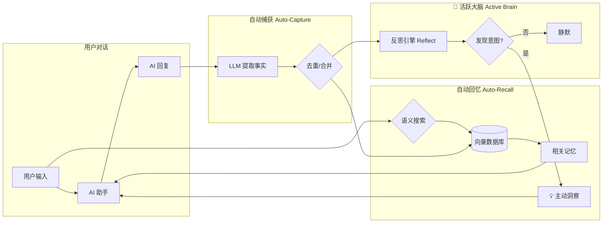

# OpenClaw 长期记忆插件 (mem0)

让你的 AI 助手拥有**真正的记忆力**。

<p align="center">
  
</p>

---

## 🤔 为什么需要这个插件？

### 与 OpenClaw 官方记忆对比

| 特性 | OpenClaw 官方记忆 | mem0 插件 |
|------|-------------------|-----------|
| **记忆方式** | 文件存储 (memory.md) | 向量数据库 + 语义搜索 |
| **召回方式** | 全量加载到上下文 | 智能搜索最相关的 Top-K |
| **存储效率** | 随对话增长，上下文膨胀 | 记忆去重、合并、更新 |
| **相关性** | 全部记忆都加载 | 只召回语义相关的记忆 |
| **多用户** | 单用户 | 支持多用户隔离 |
| **跨会话** | ✅ | ✅ |

**简单来说：**
- 官方记忆像一本**笔记本**，越写越厚，每次都要翻完
- mem0 像一个**智能秘书**，只告诉你当前需要知道的

### 与原版 mem0 插件对比

这个项目是基于 [mem0ai/mem0](https://github.com/mem0ai/mem0) 官方 SDK 的增强版本：

| 特性 | 原版 mem0 | 本插件 (增强版) |
|------|-----------|----------------|
| **嵌入模型** | Ollama + nomic-embed-text (768 dims) | transformersjs + Qwen3 (1024 dims) |
| **外部依赖** | 需要 Ollama 服务 | 零依赖，纯 Node.js |
| **LLM 兼容** | 需要返回纯 JSON | 自动清理 markdown 包装 |
| **存储路径** | 不固定 (随 cwd 变化) | 固定在 `~/.openclaw/` |
| **多语言** | 英文为主 | 100+ 语言（Qwen3） |
| **Proactive Agent** | ✅ autoRecall + autoCapture | ✅ 完全保留 |

**增强内容：**
- 🚀 **TransformersJsEmbedder** — 本地 ONNX 嵌入，无需 Ollama
- 🔧 **JsonCleaningLLM** — 自动剥离 Gemini 等模型返回的 markdown
- 📁 **固定存储路径** — 避免数据分散在不同目录

---

## 💡 插件设计与运行逻辑

### 1. 是“开箱即用”吗？
**核心部分（嵌入模型）是开箱即用的**。
*   **零外部依赖**：无需安装 Ollama 或 Python。
*   **全自动模型下载**：首次运行（搜索或对话）时，插件会自动下载并缓存约 700MB 的 Qwen3 嵌入模型，随后即可离线使用。

### 2. 用户还需要配置什么？
用户唯一需要关注的是 **LLM 的配置**。因为 mem0 需要 LLM 来从对话中提取新知识：
*   **推荐方案**：使用 **Antigravity Manager** 项目，或者 OpenAI 以及支持 OpenAI 格式的 API 平台。
*   **本地方案**：如果你追求纯本地，也可以指向自建的 **Ollama** (如 `llama3`)。

### 3. 会和 OpenClaw 自带的记忆冲突吗？
**不会，它们是相辅相成的并联关系：**
*   **共同存在**：官方 `.md` 记忆和 mem0 数据库独立运行，不会互相覆盖。
*   **高优先级召回**：mem0 会在 Agent 响应前，将最相关的背景直接注入到“系统上下文”中。Agent 一睁眼就能看到这些精准信息，而不需要去翻阅长长的文件。

---

## 📊 工作原理



### 流程说明

1. **自动回忆 (Auto-Recall)**
   - 用户发送消息时，插件自动搜索向量数据库
   - 找到语义最相关的 Top-K 条记忆
   - 注入到 AI 的上下文中

2. **自动捕获 (Auto-Capture)**
   - AI 回复后，插件调用 LLM 提取对话中的重要事实
   - 新事实自动去重、与旧记忆合并
   - 存入向量数据库

3. **🧠 活跃大脑 (Active Brain)** — *灵感源自 [memU](https://github.com/NevaMind-AI/memU)*
   - 每次存入新记忆后，**反思引擎**自动分析对话，发现用户隐含意图
   - 检测到任务/提醒/跟进时，生成待触发行动
   - 心跳定时器每 60 秒检查一次，到期行动在下次对话时自动注入上下文
   - 全程静默运行，无需任何配置

---

## ✨ 核心优势

| 优势 | 说明 |
|------|------|
| 🧠 **智能记忆** | 自动提取对话中的重要信息，无需手动记录 |
| 🔍 **语义搜索** | 基于意思而非关键词匹配，找到真正相关的记忆 |
| 🏠 **完全本地** | 支持本地嵌入模型，数据不出本机 |
| 📦 **零依赖** | 使用 transformersjs，无需 Ollama、Python |
| 🌍 **多语言** | Qwen3 模型支持 100+ 语言（包括中文） |
| 🔄 **自动去重** | 相似记忆自动合并，避免重复 |

---

## 🚀 快速开始

### 1. 安装插件

```bash
openclaw plugins install https://github.com/1960697431/openclaw-mem0
```

### 2. 配置 (openclaw.json)

在 `plugins.entries` 中添加：

```json
"openclaw-mem0": {
  "enabled": true,
  "config": {
    "mode": "open-source",
    "userId": "你的用户名",
    "autoRecall": true,
    "autoCapture": true,
    "oss": {
      "embedder": {
        "provider": "transformersjs",
        "config": { "model": "onnx-community/Qwen3-Embedding-0.6B-ONNX" }
      },
      "vectorStore": {
        "provider": "memory",
        "config": {
          "dimension": 1024,
          "dbPath": "~/.openclaw/mem0-vectors.db"
        }
      },
      "llm": {
        "provider": "openai",
        "config": {
          "apiKey": "你的API密钥",
          "model": "gpt-4o",
          "baseURL": "https://api.openai.com/v1"
        }
      },
      "historyDbPath": "~/.openclaw/mem0-history.db"
    }
  }
}
```

### 3. 重启 OpenClaw

```bash
launchctl kickstart -k gui/$(id -u)/ai.openclaw.gateway
```

首次启动会自动下载嵌入模型（约 700MB）。

---

## 🔧 配置详解

### 本地嵌入模型 (推荐)

使用 `transformersjs` 运行本地 ONNX 模型，**无需 Ollama、无需 Python、无需 API**：

| 模型 | 维度 | 大小 | 语言 |
|------|------|------|------|
| `onnx-community/Qwen3-Embedding-0.6B-ONNX` ⭐ | 1024 | ~700MB | 100+ |
| `Xenova/bge-small-en-v1.5` | 384 | ~130MB | 英文 |
| `Xenova/multilingual-e5-large` | 1024 | ~2GB | 多语言 |

### 使用 Antigravity Manager (推荐给国内用户)

如果你使用 **Antigravity Manager** 项目或其代理服务，可以这样配置 LLM：

```json
"llm": {
  "provider": "openai",
  "config": {
    "apiKey": "你的Antigravity密钥",
    "model": "gemini-3-flash",
    "baseURL": "http://localhost:8045/v1"
  }
}
```

> ⚠️ **注意**：Gemini 等模型返回 JSON 时会包装在 markdown 代码块中。本插件已内置 `JsonCleaningLLM` 自动处理此问题。

### 使用 OpenAI API

```json
"llm": {
  "provider": "openai",
  "config": {
    "apiKey": "${OPENAI_API_KEY}",
    "model": "gpt-4o"
  }
}
```

### 使用 Ollama (本地 LLM)

```json
"llm": {
  "provider": "ollama",
  "config": {
    "model": "llama3",
    "baseURL": "http://localhost:11434"
  }
}
```

---

## 🛠️ AI 工具

安装后，AI 助手可以使用以下工具：

| 工具 | 说明 |
|------|------|
| `memory_search` | 搜索记忆 |
| `memory_store` | 保存记忆 |
| `memory_list` | 列出所有记忆 |
| `memory_get` | 获取指定记忆 |
| `memory_forget` | 删除记忆 |

---

## 📋 CLI 命令

```bash
# 搜索记忆
openclaw mem0 search "用户的编程偏好"

# 查看统计
openclaw mem0 stats

# 列出所有记忆
openclaw mem0 list
```

---

## ❓ 常见问题

**Q: 记忆存储在哪里？**
A: 默认在 `~/.openclaw/mem0-vectors.db`，通过 `dbPath` 可自定义。

**Q: 需要翻墙吗？**
A: 使用本地嵌入模型 (`transformersjs`) 不需要。LLM 部分取决于你的配置。

**Q: 支持多用户吗？**
A: 支持。设置不同的 `userId` 即可隔离记忆。

**Q: 与官方记忆会冲突吗？**
A: 不会。两者独立运行，可以同时使用。

---

## 📄 License

Apache 2.0

---

<details>
<summary><strong>🇬🇧 English Documentation</strong></summary>

## What is this?

Long-term memory plugin for [OpenClaw](https://github.com/openclaw/openclaw) agents, powered by [Mem0](https://mem0.ai).

Your agent forgets everything between sessions. This plugin fixes that. It watches conversations, extracts what matters, and brings it back when relevant — automatically.

### Features

- **Auto-Recall** — Injects relevant memories before each response
- **Auto-Capture** — Extracts and stores facts after each exchange
- **Local Embeddings** — Run ONNX models locally via transformers.js
- **Multi-language** — Qwen3 supports 100+ languages

### Quick Start

```bash
openclaw plugins install https://github.com/1960697431/openclaw-mem0
```

See the Chinese documentation above for detailed configuration.

</details>
